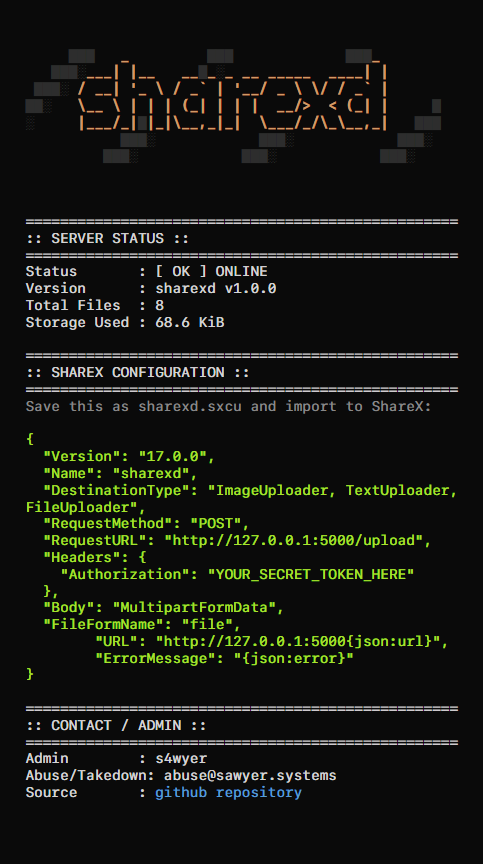
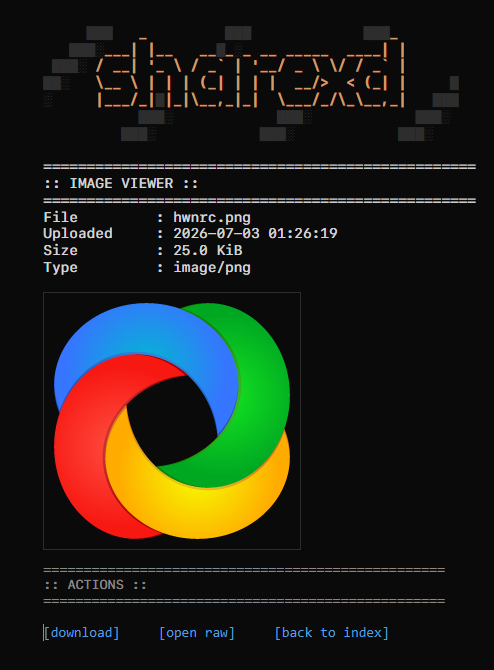
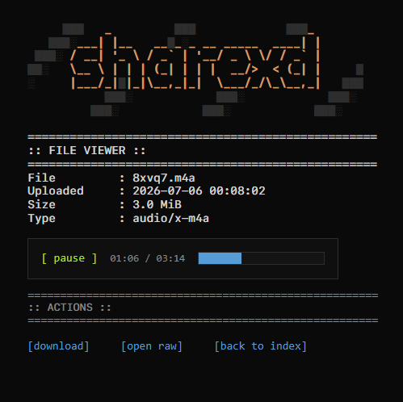

# sharexd

A minimalist, secure, self-hosted file sharing server built with Python and Flask.

Main Page                            | Image Viewer                                        |  Audio Player |
:-----------------------------------:|:---------------------------------------------------:|:---------------:|
    |                  |  |
[Preview](https://x.sawyer.systems)  | [Preview](https://x.sawyer.systems/view/i22xo.png)  | [Preview](https://x.sawyer.systems/view/8xvq7.m4a) |

## Features

- Audio, text and image viewers.
- Simple interface, only a little bit of bloat.
- Support for S3-compatible storage  and local storage with statistics on the home page.
- Token-based authentication, secure CSP headers, and plain text serving for potentially dangerous files to prevent XSS.
- Automatic `.sxcu` generation for ShareX, a bash script ([sxd.sh](sxd.sh)), and an Apple Shortcut for iOS/macOS.
- Unique deletion keys generated on upload.

## Prerequisites

- Python 3.14 or newer
- `uv` (recommended) or `pip`

## Setup

1. Clone the repo
   ```bash
   git clone https://github.com/s4wyer/sharexd.git
   cd sharexd
   ```

2. Copy the example config files and set your custom values (especially your user password and `MASTER_KEY`).
   ```bash
   cp .env.example .env
   cp users.json.example users.json
   ```

3. Install dependencies. I use uv for dependency management, but pip works fine.
   ```bash
   uv sync
   # or using pip:
   # pip install .
   ```

4. Run the server
   ```bash
   # Production
   make prod
   # Development
   make dev
   ```
5. (Optional) Set up S3 support in your `.env` (example configuration for R2 [here](docs/r2_setup.md))

## Uploading Files

Just go to wherever you have the project running to find a ShareX config.

There are multiple ways to upload files from your devices:

1. Bash Script ([sxd.sh](sxd.sh))

The project includes a shell script. It supports configuring variables via an `.sxdrc` file, which is created the first time you run the script. Pass file names as arguments.

```bash
./sxd.sh abc123.txt def456.txt
```

2. Apple Shortcut

You can also use the [ShareXD Apple Shortcut](https://www.icloud.com/shortcuts/43fb07c9c48d4445b675fb07363a516f) to upload files from iOS or macOS.

3. API (cURL)

Uploads require the `Authorization` header to match your configured `UPLOAD_TOKEN`.

```bash
curl -X POST -H "Authorization: YOUR_SECRET_TOKEN_HERE" -F "file=@yourfile.png" http://localhost:5000/upload
```

The response will provide the path to the uploaded file, and a unique deletion path:

```json
{"url": "/view/abc12.txt", "delete_url": "/delete/abc12.txt/abcdef"}
```

## Donate

If you find this project helpful and would like to support its development, you can do so via [Ko-fi](https://ko-fi.com/s4wyer_) or [GitHub Sponsors](https://github.com/sponsors/s4wyer).

## License

This project is licensed under the GNU Affero General Public License v3.0 - see [LICENSE.md](LICENSE.md) for details.
